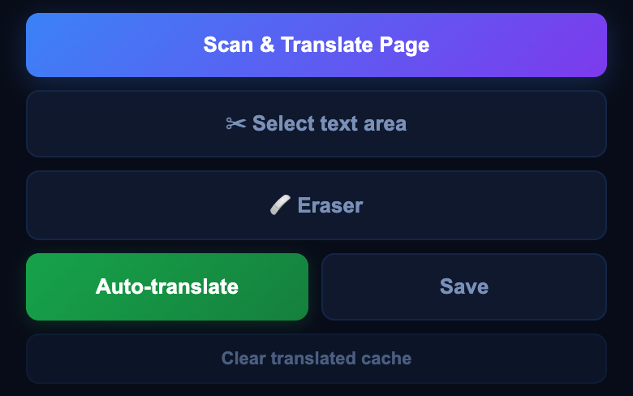
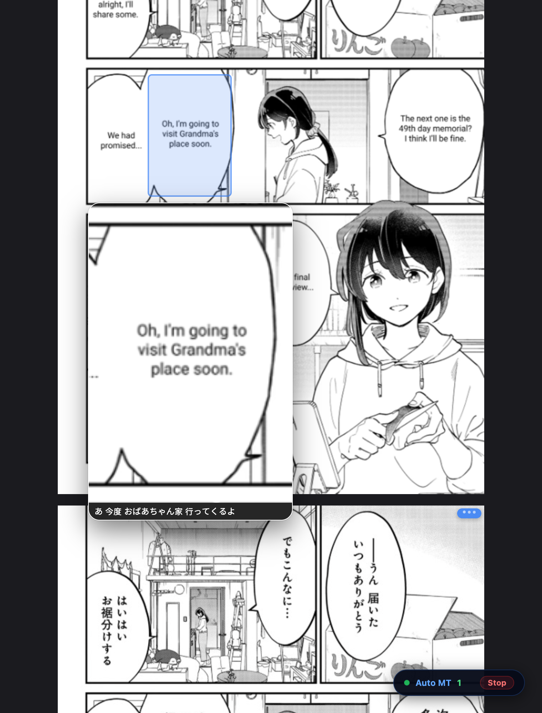
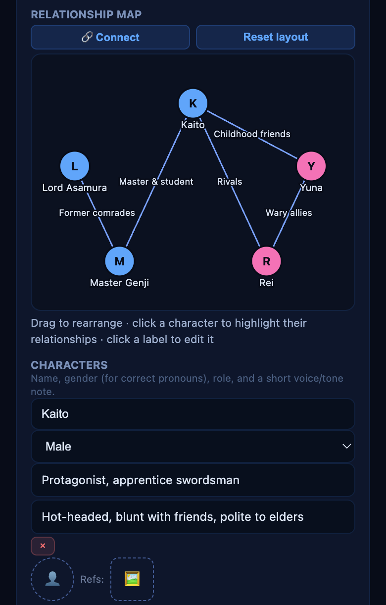
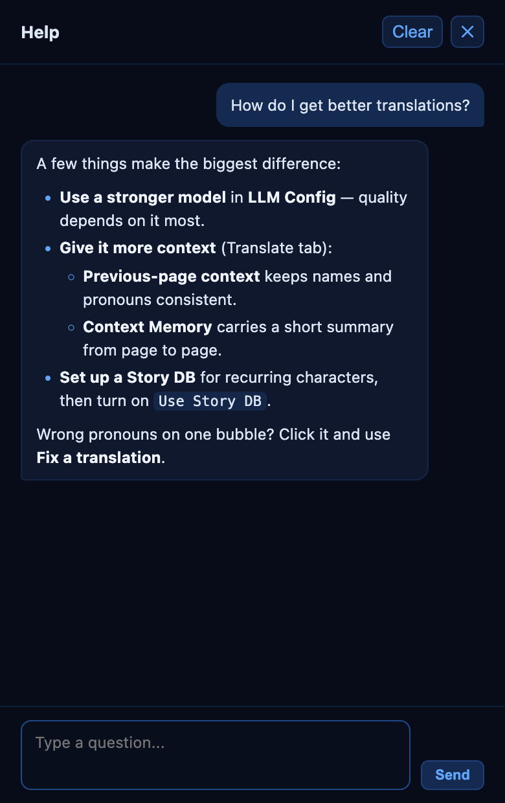
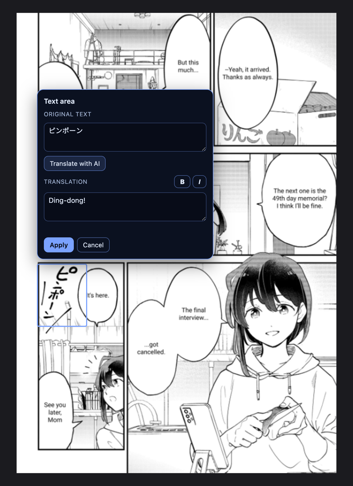

<h1 align="center">MangaTranslator Extension</h1>

<p align="center">
  Translate manga pages directly in your browser with the LLM provider you configure, a local FastAPI backend, batch page scanner, auto-translate mode, multilingual UI, and optional Flux inpainting.
</p>

<p align="center">
  <a href="docs/README.vi.md">Tiếng Việt</a>
  ·
  <a href="docs/README.zh.md">中文</a>
</p>

<p align="center">
  
  
  
  
  
</p>

<p align="center">
  <a href="#showcase">Showcase</a>
  ·
  <a href="#features">Features</a>
  ·
  <a href="#download">Download</a>
  ·
  <a href="#quick-start">Quick Start</a>
  ·
  <a href="#configuration">Configuration</a>
  ·
  <a href="#optional-flux">Optional Flux</a>
  ·
  <a href="#web-app-no-extension-needed">Web App</a>
  ·
  <a href="#development">Development</a>
</p>

<p align="center">
  
</p>

## Overview

MangaTranslator Extension is a portable browser-extension stack for translating manga and comic pages. The browser extension scans images on the current page, sends them to a local backend, and replaces or previews the translated result. The backend runs locally, so the browser does not need to send manga images through a third-party extension server.

The extension uses the LLM, API key, model, and Base URL that you provide. You can connect it to Google, OpenAI, Anthropic, OpenRouter, DeepSeek, xAI, Z.ai, Moonshot AI, or any OpenAI-compatible endpoint, then keep the translation workflow inside the browser.

The default install stays lightweight: the backend downloads its (non-Flux) models automatically the first time you use it, and Flux Klein 4B is optional, installed later with `setup.bat` only if you need heavier outside-bubble inpainting.

## Showcase

MangaTranslator Extension is built for people who want to keep reading, not copy text into separate tools. Open a chapter, scan the page, choose the images you want, and let your own LLM translate the dialogue back into the manga image.

| Popup controls | Page scanner |
| --- | --- |
| <br><br> |  |
| Source/target languages, Story DB, outside-bubble text and inpainting quality. The header shows backend status, the **?** help chat and **⤢** open-in-window. Below the settings: scan the page, select a text area, erase, or start **Auto-translate**. | Scan a chapter, preview detected pages, select only what you need, and translate pages in batch. |

### Translation Result

| Original page | Translated page |
| --- | --- |
|  |  |

- Bring your own LLM: use the provider, API key, model, and endpoint you trust.
- Read faster with auto-translate: pages are translated as you scroll, including lookahead pages.
- Keep the manga feel: original text is cleaned and translated text is rendered back into the image.
- Translate more than bubbles: SFX, narration, captions, and other outside-bubble text can be handled too.
- Stay lightweight by default: Flux Klein 4B is optional, so normal users do not need to download a workstation-sized package.

### Auto-Translate As You Read



Click **Auto-translate** in the popup (or press **Alt+Shift+A**, **⌘+Shift+A** on Mac) and just keep reading. Pages are translated as they come into view, plus a few pages ahead, so the next page is usually ready before you get there.

- **Blue `•••` badge**: the page is being translated right now (bottom page above).
- **Green `MT` badge**: the page is done. A page that fails 3 times shows a red badge instead; click it to retry.
- **Hover a bubble** to magnify it, with the original text underneath to check the translation. A button on each page switches between the translated and original image.
- The **Auto MT** pill in the corner counts translated pages; click **Stop** to end the session.

Turn on **Pre-translate** to translate pages as soon as they load instead of when you scroll near them (faster reading, more API calls). The **Extension Enabled** switch at the top of the popup turns everything off, so nothing is ever sent by surprise.

### Story DB and Help Chat

| Story DB | Help chat |
| --- | --- |
|  |  |
| Keep a story's characters, relationships, and fixed term translations in one place, so names and pronouns stay consistent from chapter to chapter. Drag characters around the relationship map, or use **Connect** to link two of them. | Click **?** in the popup and ask how to set something up. Answers come from your own LLM, based on this project's documentation. |

### Fix What Auto-Translate Missed



Auto-translate left the "ピンポーン" sound effect untouched. Click **✂ Select text area**, drag a box over it, and the text is read for you. Type a translation or click **Translate with AI**, then **Apply** to clean the spot and draw the new text into the page. For curved or diagonal text that a box can't isolate, use **🩹 Eraser** to paint over it instead.

## Features

| Area | What it does |
| --- | --- |
| Bring-your-own LLM | Uses the LLM provider, API key, model, and Base URL configured by the user. |
| Provider/key rotation | On rate limit, automatically retries with backup API keys for the same provider, then falls back to other configured providers, in order. Rotation order is configurable (round-robin/random/sequential); under Random, each key can be given its own weight to bias how often it's picked. A rate-limited key's cooldown uses the provider's own `Retry-After` response header when it sends one, instead of a blind fixed guess, so it's retried at the right time. Each provider/model in the list can also override Reasoning Effort just for itself, falling back to the general setting when left unset. |
| Test API Key | A "Test" button next to each API key (and "Test all keys" per provider) sends a minimal request to confirm that key/model/URL actually works, without spending a real translation — a failed test shows the full provider error on demand. |
| Prompt caching | The translation system prompt (identical across every page of the same batch/auto-translate run) is cached server-side on Anthropic via `cache_control`, cutting repeat-page input cost by up to ~90%. OpenAI-compatible and Gemini providers already cache eligible prompts automatically, no configuration needed. |
| Page scanner | Finds manga/comic images on the active page and lets you choose which pages to translate. |
| Auto-translate | Click **Auto-translate** (or press **Alt+Shift+A**, **⌘+Shift+A** on Mac) and keep reading: pages are translated as they come into view, plus a few pages ahead. A floating **Auto MT** pill counts translated pages and has a **Stop** button. Optional **Pre-translate** starts pages as soon as they load. |
| Bubble translation | Detects speech bubbles, removes original text, translates, and renders text back into the image. |
| Hover-to-magnify | Hover a translated bubble for a sharp zoomed-in crop with the original text as a caption, so you can cross-check the translation at a glance. A per-page button toggles between the translated and original image. |
| Story Notes | Per-story notes (glossary, character relationships, tone) the model always follows; a "Suggest" button drafts them from your already-scanned pages. Separate from General LLM Instructions, which apply to every story. |
| Story DB (optional, requires login) | A persistent, per-story character database — characters (name/gender/role/voice, plus an optional avatar and up to 2 reference images), relationships, a glossary of fixed term translations (each term can be set to **Enforce exactly**: after translating, the term's own spelling and any variants you list are rewritten to the exact translation — it can only fix what the AI actually wrote, not an alternative translation nobody listed), and continuity notes — synced to your account. **Applied to translation only when the `Use Story DB` toggle on the `Translate` tab is on (off by default)** — selecting a story in the `Story DB` tab alone isn't enough. An interactive **relationship map** (drag characters around, click to highlight, "Connect" two characters to add a relationship) shows the cast at a glance, and its layout is saved. Reference images are sent to the model only if you turn on "Send reference images to the AI". Unsaved edits survive closing the popup — they're restored automatically next time, with a banner to discard them if you'd rather start over. Undo/Redo (Ctrl+Z / Ctrl+Shift+Z) step back and forth through your edits. Since the active story is one setting shared across every site (not per-page), a warning banner appears if the current page's site was last translated with a different story than the one now selected — it never switches anything for you, just flags a possible mismatch. Manage it from the `Story DB` tab. |
| Update Story DB from a description | In the Story DB tab, type what just happened in the story ("Chapter 39: the villain turns out to be Akira's childhood friend Hina, so they switch from casual to hostile pronouns") and click **✨ Update from description** — AI drafts the character/relationship changes and a continuity note for you to review; nothing is saved until you click Save story. Optionally turn on **Search the internet for this story** to have it look the story up and fill in developments up to the point your description mentions — unlike Suggest Notes, this is allowed to include spoilers, since tracking them is the point. |
| Story DB import/export | Export/Import JSON buttons in the Story DB tab, to back up a story or hand it to a co-translator/editor without re-typing it. |
| Vietnamese pronoun accuracy | For Vietnamese output, automatically reasons about each speaker pair's relationship (age, gender, family ties, honorifics like "onii-chan") to pick the correct pronouns (anh/em, tao/mày, etc.) and keeps them consistent across a page — no configuration needed. |
| Context Memory | Optional: the model writes a one-sentence summary each page and reuses it on later pages of the same story, keeping characters/events consistent for cheaper than sending prior pages' full text/images. |
| Fix a translation | Click a translated bubble and describe what's wrong to re-translate just that page with the correction applied to that bubble. To fix the same mistake across several pages at once (e.g. a character name), select the already-translated pages in the scanner, describe it once, and apply it to all of them. |
| Re-translate a page | Each translated page has a **↻** button under its MT / download / view-original buttons (top-right of the page). Click it to translate that one page again with your *current* settings (model, language, Story DB, instructions...) — the old translation stays on screen until the new one arrives, a failed attempt changes nothing, and it always asks the model afresh even when the backend would otherwise serve a cached answer. Corrections made with click-to-fix start over; manual text areas are re-applied. |
| Move / delete a bubble | The detector boxed the wrong spot, or shouldn't have created a bubble at all? Open the bubble's Fix popover and click **Move** (drag a new box; the old spot is restored to the original art) or **Delete** (just restores the original art). |
| Manual text area | Not happy with a spot, or the auto-detect missed one? Click **✂ Select text area** in the popup and drag a box over any text on the page: it is read automatically (OCR), then you either type the translation yourself or click **Translate with AI** (Story DB and your instructions apply). The spot is cleaned and the text drawn back into the image. Re-select the same spot to edit or delete it; boxes are remembered per page. Once applied, a text area behaves like a detected bubble: hover it for the magnified crop with the original text, click it to edit. Needs the backend running the latest code. |
| Eraser tool | For raw text/SFX a rectangle can't isolate cleanly (curved or diagonal SFX, text hugging a character's outline): click **🩹 Eraser** and paint over it with a brush; it's inpainted away. Persisted per page like the manual text area tool. |
| Economy mode | One switch to cut API cost: low-detail images, no full-page or previous-page context, no Story DB reference images, and a smaller context image. Your own settings are kept and come back when you turn it off. |
| Font settings | Pick which font pack renders translated text, and the min/max font size range, from the Translate tab — drop your own font pack (a folder of .ttf/.otf files) into `backend/fonts/` to see it in the list. A text-sharpness (supersampling) control sits in the new **Pro** tab, alongside other advanced/translator-focused controls kept out of the main tabs. |
| Web app (no extension) | Translate raw image files you have on disk — nothing needs to already be on a web page. Start the backend, open `http://localhost:7677/app` in any browser, drag files in, translate, export ZIP/CBZ. Deliberately minimal (no Story DB/rotation/manual tools) — for the full toolkit, use the extension. |
| Export | Download a single translated page as a PNG from its overlay, or export every translated page in the scanner as a ZIP in one click. |
| CBZ / PDF export | "Export CBZ" and "Export PDF" next to the ZIP export button — same pages, but numbered by scan order so they page through correctly (a plain ZIP export's filenames come from the source URLs, which don't always sort into reading order). |
| Translation progress | A small animated marker shows which page(s) are actively being translated right now, distinct from ones still waiting in the auto-translate queue. |
| Retry indicator | A page that fails auto-translate 3 times in a row shows a small red badge — click it to retry immediately. |
| Outside-bubble text | Handles SFX/narration outside speech bubbles with lightweight cleanup by default. |
| LaMa inpainting | A middle option between the lightweight OpenCV cleanup and Flux: pick **LaMa** under *Inpainting quality* (Translate tab) to rebuild panel borders, screentone and hatching behind removed text instead of smearing them. ~200MB, downloaded on first use, runs on CPU in seconds (faster on a GPU). The Eraser and Select text area tools use it too when it's selected. |
| Live AI log viewer | Debug tool: `Config` tab → **Open viewer** shows every prompt and response the backend exchanged with the AI, live, with timing, filters, search and copy buttons. Off unless `MT_LIVE_AI_LOG_ENABLED=true` on the backend; on a hosted backend only the `MT_ADMIN_EMAIL` account can open it. |
| First-use download notice | Some features fetch ML weights the first time you use them (LaMa ~0.2 GB, manga-ocr ~0.9 GB, PaddleOCR-VL ~1.9 GB). While a translation is slow, the page shows a "first-time setup: downloading …" notice instead of hanging silently. |
| Optional Flux | Lets advanced users download Flux Klein 4B for heavier inpainting without shipping it in the default release. |
| Replacement dictionary | In the **Pro** tab: deterministic `find => replace` rules (with `/regex/` support) for the fixes an AI keeps getting wrong. *After translation* rules rewrite every translation before it's drawn — exact, and they apply to already-cached pages without a new AI call. *Before translation* rules rewrite the source text; exact in the Select text area tool, and passed to the AI as instructions when it reads the page image directly. |
| Lettering options | In the **Pro** tab: ALL CAPS, left/center/right alignment, a fixed text color, and an outline (width + color) for speech-bubble and Select text area text — the usual scanlation lettering choices. Bold/italic from the AI's markers are kept. |
| Text reading | `Translate` tab select: let the AI read each bubble image (default), or read the text locally first with manga-ocr / PaddleOCR-VL and send only text to the AI — cheaper, works with text-only models, and makes the "before translation" dictionary exact. |
| Local LLM | Run fully offline with no API cost via Ollama or LM Studio (a vision model, or any text model with local OCR) through the `OpenAI-Compatible` provider — see [Local LLM](#local-llm-ollama--lm-studio). |
| Help chat | Click the **?** button in the popup header to ask how to install, configure, or use the extension — answered by your own configured LLM, grounded in this project's own docs (not a canned FAQ, and not free — it uses your API key/quota like any other AI feature here). Conversation is kept locally across popup reopens; clear it any time. |
| Resizable popup | Drag the popup's bottom-right corner to resize it (works most of the time — Chrome's own popup sizing can occasionally fight it), or click **⤢** in the header to open the same UI in a normal, freely resizable window instead. |
| Provider support | Google, OpenAI, Anthropic, xAI, DeepSeek, Z.ai, Moonshot AI, OpenRouter, and OpenAI-compatible endpoints. |
| UI languages | English by default, plus Vietnamese, Chinese, Japanese, and Korean. |
| Translation languages | Source/target fields accept ~58 suggested languages (Japanese, Korean, Chinese, Spanish, French, Arabic, ...) via autocomplete, or any language name you type — the backend has no allowlist. |
| Portable backend | Uses `start-backend.bat`, `backend/main.py`, and optional bundled `backend/runtime/python.exe`. |

## Download

Latest release:

```text
https://github.com/QuangTQV/Manga-Translator-Extension/releases/latest
```

Release assets:

| Asset | Purpose |
| --- | --- |
| `manga-translator-extension-dist-*.zip` | Built browser extension. Load the extracted `dist/` folder in Chrome/Edge. |
| `manga-translator-models-no-flux-*.zip` | Optional. Pre-downloaded backend models (no Flux) so you don't have to wait for them on first use — extract into the project root to restore `backend/models/`. Skip this and the backend downloads the same models automatically the first time you translate a page. |
| Source code (zip / tar.gz) | The repository at that release's tag, same as cloning it. |

Extract models (optional — pick the actual filename from the release you downloaded):

```powershell
Expand-Archive .\manga-translator-models-no-flux-*.zip -DestinationPath .
```

## Quick Start

1. Download the source or clone the repository.

```powershell
git clone https://github.com/QuangTQV/Manga-Translator-Extension.git
cd Manga-Translator-Extension
```

2. Set up the backend (one time).

```powershell
cd backend
python -m venv .venv
.\.venv\Scripts\pip install -e .
cd ..
```

Optional: download `manga-translator-models-no-flux-*.zip` from the [latest release](#download) and extract it into the project root to restore `backend/models/` ahead of time — otherwise the backend downloads the same models automatically the first time you translate a page.

3. Start the backend.

```powershell
.\start-backend.bat
```

The backend should listen on:

```text
http://localhost:7677
```

4. Load the browser extension.

```powershell
cd extension
npm install
npm run build
```

Then open Chrome or Edge:

```text
chrome://extensions/
```

Enable Developer mode, choose Load unpacked, and select `extension/dist/`.

## Configuration

Open the extension popup and use the tabs:

| Tab | Options |
| --- | --- |
| `Translate` | Source language, target language, `Use Story DB` toggle (off by default — required for the Story DB tab's data to actually affect translation), outside-bubble text toggle, Previous-page context, Context Memory, Story Notes (with "Suggest" to draft them). |
| `LLM Config` | Provider, Base URL, model, API key (+ optional backup keys and fallback providers, tried in order on rate limit), temperature, Top P, Top K, full-page context, General LLM Instructions. |
| `Config` | Extension UI language and backend URL. |
| `Account` | Sign in with email or Google to use optional per-account features (Story DB); also where a centrally-hosted deployment's users see their plan/usage. |
| `Story DB` | Optional, requires being logged in on `Account`. Per-story character database, relationships, a term glossary, and continuity notes, synced to your account. |
| `Pro` | Advanced controls kept out of the main tabs: text sharpness (supersampling), lettering (ALL CAPS, alignment, text color, outline), and the before/after-translation replacement dictionary. |

Default backend URL:

```text
http://localhost:7677
```

Provider keys can be entered in the popup or exposed through environment variables:

```text
GOOGLE_API_KEY
OPENAI_API_KEY
ANTHROPIC_API_KEY
```

## Local LLM (Ollama / LM Studio)

Translate offline with no API cost by pointing the `OpenAI-Compatible` provider at a model running on your own machine.

**By default you need a vision model**: the AI reads the text straight off the page image, so a text-only model (plain Llama, Qwen 2.5, ...) has nothing to translate. Examples that can see images: Qwen2.5-VL (`qwen2.5vl:7b` in Ollama), Gemma 3 (`gemma3:12b`), or any model LM Studio marks as vision-capable.

**Text-only models work too** if you set `Translate` tab → **Text reading** to `manga-ocr` (Japanese only) or `PaddleOCR-VL`: the text is read locally first and only text goes to the model. That is also cheaper and lighter for a local GPU, at the cost of the AI no longer seeing the bubble images.

**Ollama**

1. Install [Ollama](https://ollama.com), then pull a vision model: `ollama pull qwen2.5vl:7b` (the server starts on port 11434).
2. Popup → `LLM Config`: Provider `OpenAI-Compatible`, Base URL `http://localhost:11434/v1`, Model `qwen2.5vl:7b`, API key: any text such as `ollama` (the field can't be empty; Ollama ignores it).
3. Click **Test** next to the key, then translate as usual.

**LM Studio**

1. Download a vision model in [LM Studio](https://lmstudio.ai), then in the Developer tab start the local server (port 1234).
2. Popup → `LLM Config`: Provider `OpenAI-Compatible`, Base URL `http://localhost:1234/v1`, Model: the model identifier LM Studio shows, API key: any text such as `lm-studio`.

**Good to know**

- The Base URL is called by the **backend**, not the browser. If the backend runs in Docker, use `http://host.docker.internal:11434/v1`; if the model runs on another machine, use that machine's LAN address (for Ollama, start it with `OLLAMA_HOST=0.0.0.0`).
- A page sends several images at once. Ollama's default context window can be too small for that, which shows up as missing or garbled translations — start it with a bigger one, e.g. `OLLAMA_CONTEXT_LENGTH=16384 ollama serve`. **Economy mode** also helps (fewer, smaller images).
- 7-12B local models are noticeably weaker than large cloud models on small or stylized text, and a page can take tens of seconds without a strong GPU. If a small model breaks the numbered answer format (bubbles show a translation error), try a larger model or a lower temperature.
- Every other feature (Story DB, replacement dictionary, lettering, manual tools) works the same with a local model.

## Optional Flux

Flux is not bundled in the normal release because it adds several GB. The default outside-bubble mode uses lightweight cleanup and does not require Flux.

To install Flux Klein 4B on demand:

```powershell
.\setup.bat
```

Choose:

```text
2. Download optional Flux Klein 4B model
```

The script downloads to:

```text
backend/models/flux/
```

Use Flux only when you explicitly configure outside-text inpainting to a Flux mode such as `flux_klein_4b`. For most users, the default `auto` behavior is lighter and faster.

**In between: LaMa.** *Inpainting quality → LaMa* needs no GPU and no manual setup: the ~200MB model ([big-lama TorchScript export](https://huggingface.co/JosephCatrambone/big-lama-torchscript), Apache-2.0) downloads to `backend/models/lama/` the first time it's used and runs on CPU in a couple of seconds per region. It reconstructs panel borders and screentone far better than the default cleanup, though not as well as Flux on large painted areas.

**No GPU? Run Flux on a remote GPU.** The popup's *Inpainting quality* setting also offers `Flux Klein 4B (remote)` and `Flux Klein 9B (remote)`: run `backend/flux_worker.py` on a free Kaggle GPU (or any GPU box), expose it with a `cloudflared` tunnel, and paste the URL into the popup — nothing heavy is installed locally. Protect the worker with `--token` / `FLUX_WORKER_TOKEN` and put the same value in the popup's Token field. If the worker is down or rejects the token, the page still translates (outside-bubble text is left as-is), a warning toast explains why, and the backend stops retrying the dead worker for ~60 seconds. Step-by-step guide (Vietnamese): [docs/HUONG-DAN-CHAY.md](docs/HUONG-DAN-CHAY.md#8-tuỳ-chọn-chạy-flux-từ-xa-trên-gpu-free-của-kaggle).

## Web App (no extension needed)

For raw image files you already have on disk (scans that were never published to any web page — the extension can only translate `` elements it finds on a page you're browsing) run the backend as usual, then open **`http://localhost:7677/app`** in any browser. Drag files in (or use the file picker), configure the provider/key/languages in the sidebar (saved in that browser's own storage), click **Translate All**, then **Export ZIP** or **Export CBZ**.

It is deliberately minimal — no Story DB, no provider/key rotation, no manual region/eraser/font tools, no auto-translate — for that, use the extension. It talks to the same local backend over a plain `fetch()`, so nothing beyond the backend needs to be running.

## Usage Workflow

1. Start the backend with `start-backend.bat`.
2. Open a manga/comic chapter in Chrome or Edge.
3. Click the MangaTranslator extension icon.
4. Choose source and target language.
5. Click Scan & Translate Page to choose images manually, or Auto-translate to translate as you scroll.
6. Review translated images on the page.

Tip: On manga sites that use lazy-load and prevent the extension from scanning the whole chapter at once, scan and translate the next 4-5 pages first, then turn on Auto-MT for the smoothest reading experience.

## Project Layout

```text
manga-translator-extension/
  backend/                         FastAPI backend and MangaTranslator integration
  backend/main.py                  Backend entry point
  backend/core/                    Detection, cleanup, translation, rendering
  backend/models/                  Model files restored from release assets
  backend/pipeline/                Wrapper around the core pipeline
  extension/                       Manifest V3 browser extension
  extension/src/background/        Service worker and backend requests
  extension/src/content-script/    Page scanner and auto-translate overlay
  extension/src/popup/             Popup UI
  extension/src/shared/            Types, constants, i18n
  docs/                            API docs and localized READMEs
  setup.bat                        Optional setup helper, including Flux download
  start-backend.bat                Backend launcher
```

## Development

Build the extension:

```powershell
cd extension
npm install
npm run build
```

Compile-check backend files:

```powershell
cd ..\backend
python -m py_compile pipeline\wrapper.py
```

Regenerate the popup/tool screenshots in `docs/assets/` after UI changes (the backend is mocked, so nothing else needs to be running):

```powershell
cd extension
npm run build
node scripts/readme-screenshots.mjs
```

Check backend health:

```powershell
Invoke-RestMethod http://localhost:7677/health
```

## Release Packaging

Do not commit generated runtime, models, caches, or extension build output. They are intentionally ignored:

```text
backend/runtime/
backend/models/
extension/dist/
extension/node_modules/
release-assets/
```

Use GitHub Releases for runtime/model archives. GitHub blocks files over 100 MB in normal Git history, and large runtime archives should be split so each release asset stays below GitHub's release asset limit.

## FAQ

**Q: How good is the translation quality?**

A: Translation quality depends on the LLM model you use. Stronger models usually produce more natural wording, better context handling, and fewer mistranslations.

**Q: Some pages have text outside speech bubbles and the result shows white/black boxes. What should I do?**

A: Use the optional Flux Klein 4B model to improve inpainting quality for text outside bubbles, SFX, narration, and messy backgrounds.

**Q: Why does the popup show Backend Offline?**

A: Start `.\start-backend.bat`, wait until the backend is ready, then confirm that `http://localhost:7677/health` opens successfully. Also check that the Backend URL in the `Config` tab matches your local server.

**Q: Why are some manga images not detected?**

A: Wait for the reader page to finish lazy-loading, then run Scan & Translate Page again. If the site loads pages only while scrolling, scroll through the chapter once or use Auto-collect in the scanner.

**Q: I set up a Story DB and selected it, but the translation doesn't seem to use it. Why?**

A: Turn on the `Use Story DB` toggle on the `Translate` tab — selecting a story on the `Story DB` tab alone doesn't apply it, by design, so you can translate a one-off page without it even while a story is selected.

**Q: I don't understand how to set something up — is there help built in?**

A: Click the **?** button in the popup header to ask a question. It's answered by your own configured LLM using this project's own documentation, not a canned script — so it costs a small amount of your API quota, same as any other AI feature here.

## Troubleshooting

| Problem | Fix |
| --- | --- |
| Backend offline in popup | Start `.\start-backend.bat` and confirm `http://localhost:7677/health`. |
| Extension cannot connect | Check the backend URL in the `Config` tab. |
| No images found | Let the manga page finish loading, then run Scan & Translate Page again. |
| Model/provider error | Check API key, Base URL, model name, and provider selection. |
| Flux download fails | Re-run `setup.bat`, check disk space and internet connection. |
| `pip install -e .` fails in `backend/` | Confirm Python 3.10+ and that the virtual environment is activated before installing. |

## Security

Never commit API keys, private backend URLs, generated caches, model artifacts, `node_modules`, `dist`, or a full Python runtime. Keep secrets in the extension popup or environment variables.

## License

This portable build includes code derived from MangaTranslator. Keep upstream license requirements with any redistribution.
