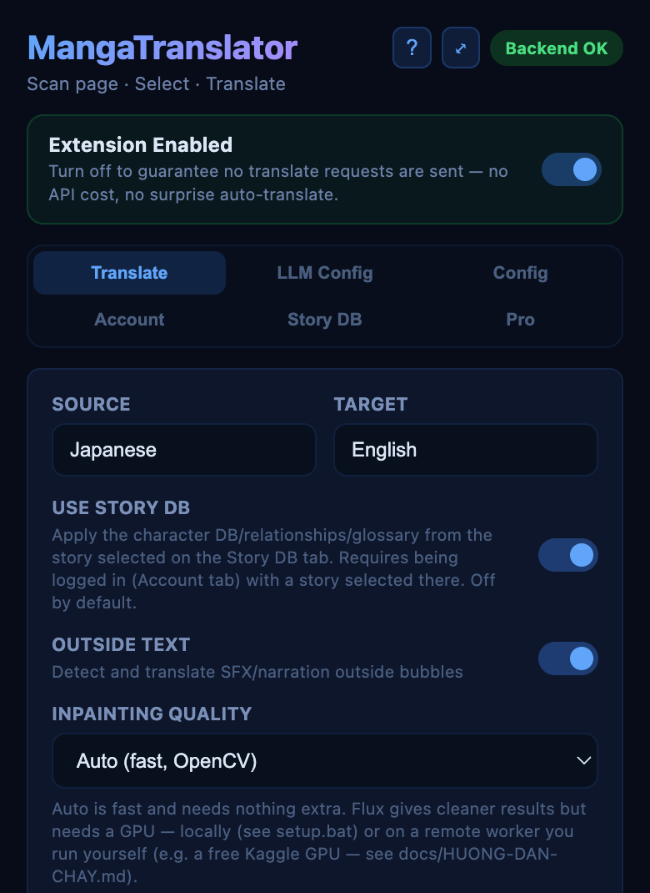

<h1 align="center">MangaTranslator Extension</h1>

<p align="center">
  Dịch manga trực tiếp trong trình duyệt bằng backend FastAPI cục bộ, chế độ tự động dịch, giao diện đa ngôn ngữ và Flux inpainting tùy chọn.
</p>

<p align="center">
  <a href="../README.md">English</a>
  ·
  <a href="README.zh.md">中文</a>
</p>

<p align="center">
  
  
  
  
  
</p>

<p align="center">
  <a href="#showcase">Showcase</a>
  ·
  <a href="#tổng-quan">Tổng Quan</a>
  ·
  <a href="#tính-năng">Tính Năng</a>
  ·
  <a href="#tải-xuống">Tải Xuống</a>
  ·
  <a href="#bắt-đầu-nhanh">Bắt Đầu Nhanh</a>
  ·
  <a href="#cấu-hình">Cấu Hình</a>
  ·
  <a href="#flux-tùy-chọn">Flux Tùy Chọn</a>
</p>

<p align="center">
  
</p>

## Showcase

MangaTranslator Extension được tạo cho người đọc muốn đọc truyện liền mạch, không phải copy từng câu sang công cụ khác. Chỉ mở một chapter, quét trang, chọn ảnh cần dịch, và để LLM hoàn thành việc còn lại.

| Popup điều khiển | Trình quét trang |
| --- | --- |
|  |  |
| Cấu hình ngôn ngữ, nhận diện chữ ngoài bubble, trạng thái backend và auto-translate một chạm. | Quét chapter, xem trước các trang đã phát hiện, chọn đúng ảnh cần dịch và dịch hàng loạt. |

### Kết Quả Dịch

| Trang gốc | Trang đã dịch |
| --- | --- |
|  |  |

- Sử dụng LLM của bạn: cấu hình provider, API key, model và endpoint mà bạn dùng.
- Đọc nhanh hơn với auto-translate: ảnh được dịch khi bạn cuộn trang, kèm dịch trước các trang sắp tới.
- Giữ cảm giác manga: chữ gốc được xóa và chữ dịch được render lại vào ảnh.
- Dịch cả ngoài bubble: hỗ trợ SFX, lời dẫn, caption và các đoạn chữ nằm ngoài bóng thoại.
- Nhẹ hơn theo mặc định: Flux Klein 4B là tùy chọn, nên người dùng thông thường không phải tải một gói quá nặng.

## Tổng Quan

MangaTranslator Extension là bộ extension + backend portable để dịch trang manga/comic. Extension trong trình duyệt quét ảnh trên tab hiện tại, gửi ảnh đến backend cục bộ, rồi thay hoặc hiển thị bản dịch đã render. Backend chạy trên máy của bạn, nên extension không cần gửi ảnh manga qua một máy chủ extension bên thứ ba.

Extension sử dụng LLM, API key, model và Base URL do bạn cung cấp. Bạn có thể kết nối Google, OpenAI, Anthropic, OpenRouter, DeepSeek, xAI, Z.ai, Moonshot AI hoặc bất kỳ endpoint OpenAI-compatible nào, sau đó giữ toàn bộ workflow dịch ngay trong trình duyệt.

Cài đặt mặc định giữ nhẹ: backend tự tải model (không Flux) trong lần dùng đầu tiên, còn Flux Klein 4B là tùy chọn, chỉ cài bằng `setup.bat` khi bạn cần inpainting nặng hơn cho chữ ngoài bubble.

## Tính Năng

| Khu vực | Chức năng |
| --- | --- |
| LLM của bạn | Sử dụng provider, API key, model và Base URL do người dùng cấu hình. |
| Xoay tua provider/key | Khi bị rate limit, tự động thử lần lượt các API key dự phòng cùng provider, rồi chuyển sang các provider dự phòng đã cấu hình. Kiểu xoay tua có thể cấu hình (tuần tự/ngẫu nhiên/round-robin); ở chế độ Ngẫu nhiên, mỗi key có thể đặt trọng số riêng để tăng tỉ lệ được chọn. Thời gian cooldown của key bị rate-limit sẽ dùng header `Retry-After` thật do provider trả về nếu có, thay vì đoán cố định — nhờ đó key được thử lại đúng thời điểm. Mỗi provider/model trong danh sách cũng có thể tự đặt riêng Mức độ suy luận, không set thì dùng mặc định theo cấu hình chung. |
| Test API Key | Nút "Test" cạnh mỗi API key (và "Test tất cả key" cho từng provider) gửi 1 request tối thiểu để kiểm tra key/model/URL đó có hoạt động không, không tốn 1 lượt dịch thật — nếu fail có thể xem đầy đủ lỗi từ provider. |
| Cache prompt | Phần system prompt dịch (giống hệt nhau ở mọi trang trong cùng 1 lượt quét/auto-translate) được cache phía server trên Anthropic qua `cache_control`, giảm tới ~90% chi phí input cho các trang sau. Provider tương thích OpenAI và Gemini đã tự động cache prompt đủ điều kiện, không cần cấu hình. |
| Trình quét trang | Tìm ảnh manga/comic trên trang hiện tại và cho phép chọn trang cần dịch. |
| Tự động dịch | Theo dõi trang đọc hiện tại và dịch ảnh khi bạn cuộn. |
| Dịch bubble | Nhận diện bubble thoại, xóa chữ gốc, dịch và render chữ lại vào ảnh. |
| Di chuột phóng to | Di chuột vào 1 bubble đã dịch để xem bản crop phóng to sắc nét kèm chú thích là chữ gốc, giúp đối chiếu bản dịch nhanh chóng. Có nút chuyển qua lại giữa ảnh đã dịch và ảnh gốc cho từng trang. |
| Ghi chú truyện | Ghi chú riêng cho từng truyện (glossary, quan hệ nhân vật, văn phong) mà model luôn tuân theo; có nút "Suggest" để tự soạn nháp từ các trang đã quét. Khác với Chỉ dẫn chung cho LLM (áp dụng mọi truyện). |
| Xưng hô tiếng Việt chính xác | Khi dịch sang tiếng Việt, tự động suy luận quan hệ từng cặp nhân vật (tuổi, giới tính, quan hệ gia đình, honorific như "onii-chan") để chọn đúng xưng hô (anh/em, tao/mày...) và giữ nhất quán suốt trang — không cần cấu hình gì. |
| Trí nhớ context | Tùy chọn: model tự viết 1 câu tóm tắt mỗi trang và dùng lại ở các trang sau trong cùng truyện, giữ nhân vật/sự kiện nhất quán mà rẻ hơn gửi kèm ảnh/chữ đầy đủ của trang trước. |
| Sửa bản dịch | Bấm vào 1 bubble đã dịch, mô tả chỗ sai để dịch lại đúng trang đó với hướng dẫn sửa áp riêng cho bubble đó. Để sửa cùng 1 lỗi lặp lại trên nhiều trang (vd tên nhân vật sai), chọn các trang đã dịch trong trình quét, mô tả 1 lần rồi áp dụng cho tất cả. |
| Xuất file | Tải PNG 1 trang đã dịch ngay trên overlay, hoặc xuất toàn bộ trang đã dịch trong trình quét thành 1 file ZIP chỉ với 1 lần bấm. |
| Đang dịch | Một dấu hiệu nhỏ động (3 chấm nhấp nhô) hiện ở trang nào đang thật sự được dịch, phân biệt với các trang còn đang chờ trong hàng đợi auto-translate. |
| Báo hiệu thử lại | Trang bị lỗi auto-translate 3 lần liên tiếp sẽ hiện badge đỏ nhỏ — bấm vào để thử lại ngay. |
| Chữ ngoài bubble | Xử lý SFX/lời dẫn ngoài bubble bằng cleanup nhẹ mặc định. |
| Flux tùy chọn | Cho phép người dùng nâng cao tải Flux Klein 4B để inpainting nặng hơn mà không làm nặng release mặc định. |
| Provider | Google, OpenAI, Anthropic, xAI, DeepSeek, Z.ai, Moonshot AI, OpenRouter và endpoint OpenAI-compatible. |
| Ngôn ngữ UI | Tiếng Anh mặc định, kèm tiếng Việt, tiếng Trung, tiếng Nhật và tiếng Hàn. |
| Ngôn ngữ dịch | Ô nguồn/đích gợi ý sẵn khoảng 58 ngôn ngữ (Nhật, Hàn, Trung, Tây Ban Nha, Pháp, Ả Rập...) qua autocomplete, hoặc gõ tự do bất kỳ ngôn ngữ nào — backend không giới hạn danh sách. |
| Backend portable | Dùng `start-backend.bat`, `backend/main.py` và runtime `backend/runtime/python.exe` nếu có. |

## Tải Xuống

Release mới nhất:

```text
https://github.com/QuangTQV/Manga-Translator-Extension/releases/latest
```

Các asset của release:

| Asset | Mục đích |
| --- | --- |
| `manga-translator-extension-dist-*.zip` | Extension đã build. Giải nén và load thư mục `dist/` trong Chrome/Edge. |
| `manga-translator-models-no-flux-*.zip` | Tùy chọn. Model backend tải sẵn (không Flux) để khỏi chờ tải khi dùng lần đầu — giải nén vào root project để khôi phục `backend/models/`. Bỏ qua bước này thì backend vẫn tự tải đúng model đó khi bạn dịch trang đầu tiên. |
| Source code (zip / tar.gz) | Toàn bộ repo tại tag của release đó, giống hệt clone. |

Giải nén model (tùy chọn — thay đúng tên file của release bạn đã tải):

```powershell
Expand-Archive .\manga-translator-models-no-flux-*.zip -DestinationPath .
```

## Bắt Đầu Nhanh

1. Tải source hoặc clone repository.

```powershell
git clone https://github.com/QuangTQV/Manga-Translator-Extension.git
cd Manga-Translator-Extension
```

2. Cài đặt backend (chỉ cần làm 1 lần).

```powershell
cd backend
python -m venv .venv
.\.venv\Scripts\pip install -e .
cd ..
```

Tùy chọn: tải `manga-translator-models-no-flux-*.zip` từ [release mới nhất](#tải-xuống) rồi giải nén vào root project để khôi phục `backend/models/` trước — nếu bỏ qua, backend sẽ tự tải đúng model đó khi bạn dịch trang đầu tiên.

3. Khởi động backend.

```powershell
.\start-backend.bat
```

Backend sẽ lắng nghe tại:

```text
http://localhost:7677
```

4. Load extension trình duyệt.

```powershell
cd extension
npm install
npm run build
```

Sau đó mở Chrome hoặc Edge:

```text
chrome://extensions/
```

Bật Developer mode, chọn Load unpacked và chọn `extension/dist/`.

## Cấu Hình

Mở popup extension và dùng ba tab:

| Tab | Tùy chọn |
| --- | --- |
| `Translate` | Ngôn ngữ nguồn, ngôn ngữ đích, bật/tắt chữ ngoài bubble, Previous-page context, Trí nhớ context, Ghi chú truyện (có nút "Suggest" để soạn nháp). |
| `LLM Config` | Provider, Base URL, model, API key (+ key dự phòng và provider dự phòng tùy chọn, thử lần lượt khi bị rate limit), temperature, Top P, Top K, ngữ cảnh toàn trang, Chỉ dẫn chung cho LLM. |
| `Config` | Ngôn ngữ giao diện extension và backend URL. |

Backend URL mặc định:

```text
http://localhost:7677
```

Provider key có thể nhập trong popup hoặc truyền qua biến môi trường:

```text
GOOGLE_API_KEY
OPENAI_API_KEY
ANTHROPIC_API_KEY
```

## Flux Tùy Chọn

Flux không đi kèm release thường vì tăng dung lượng thêm vài GB. Chế độ chữ ngoài bubble mặc định dùng cleanup nhẹ và không cần Flux.

Cài Flux Klein 4B khi cần:

```powershell
.\setup.bat
```

Chọn:

```text
2. Download optional Flux Klein 4B model
```

Script sẽ tải vào:

```text
backend/models/flux/
```

Chỉ dùng Flux khi bạn cấu hình outside-text inpainting sang một mode Flux như `flux_klein_4b`. Với đa số người dùng, mặc định `auto` nhẹ hơn và nhanh hơn.

## Quy Trình Sử Dụng

1. Chạy backend bằng `start-backend.bat`.
2. Mở chapter manga/comic trong Chrome hoặc Edge.
3. Bấm biểu tượng MangaTranslator.
4. Chọn ngôn ngữ nguồn và đích.
5. Bấm Scan & Translate Page để chọn ảnh thủ công, hoặc Auto-translate để dịch khi cuộn.
6. Kiểm tra ảnh đã dịch trên trang.

Lời khuyên: Khi gặp các web có lazy-load khiến extension không quét được toàn bộ trang truyện cùng lúc, hãy scan và dịch trước 4-5 trang truyện, sau đó bật Auto-MT để có trải nghiệm đọc mượt mà nhất.

## Cấu Trúc Dự Án

```text
manga-translator-extension/
  backend/                         Backend FastAPI và tích hợp MangaTranslator
  backend/main.py                  Điểm vào backend
  backend/core/                    Nhận diện, cleanup, dịch, render
  backend/models/                  Model khôi phục từ release assets
  backend/pipeline/                Wrapper quanh core pipeline
  extension/                       Browser extension Manifest V3
  extension/src/background/        Service worker và request tới backend
  extension/src/content-script/    Trình quét trang và overlay tự động dịch
  extension/src/popup/             Giao diện popup
  extension/src/shared/            Types, constants, i18n
  docs/                            API docs và README đa ngôn ngữ
  setup.bat                        Trợ lý setup tùy chọn, gồm tải Flux
  start-backend.bat                Launcher backend
```

## Phát Triển

Build extension:

```powershell
cd extension
npm install
npm run build
```

Compile-check backend:

```powershell
cd ..\backend
python -m py_compile pipeline\wrapper.py
```

Kiểm tra health backend:

```powershell
Invoke-RestMethod http://localhost:7677/health
```

## Đóng Gói Release

Không commit runtime, model, cache hoặc build output. Các đường dẫn này được ignore có chủ đích:

```text
backend/runtime/
backend/models/
extension/dist/
extension/node_modules/
release-assets/
```

Hãy dùng GitHub Releases cho runtime/model archives. GitHub chặn file trên 100 MB trong Git history thường, và archive runtime lớn nên được chia nhỏ để mỗi release asset nằm dưới giới hạn của GitHub.

## FAQ

**Q: Chất lượng dịch thuật thì sao?**

A: Chất lượng dịch dựa trên model LLM mà bạn sử dụng. Model càng tốt thì câu dịch thường tự nhiên hơn, hiểu ngữ cảnh tốt hơn và ít dịch sai hơn.

**Q: Một số trang dịch không có bubble thì bị hiện khung nền trắng/đen, phải làm sao?**

A: Hãy sử dụng model Flux Klein 4B tùy chọn để cải thiện chất lượng inpainting cho chữ ngoài bubble, SFX, lời dẫn và nền ảnh phức tạp.

**Q: Vì sao popup báo Backend Offline?**

A: Chạy `.\start-backend.bat`, chờ backend khởi động xong, rồi kiểm tra `http://localhost:7677/health`. Đồng thời kiểm tra Backend URL trong tab `Config` có đúng server local của bạn không.

**Q: Vì sao một số ảnh manga không được tìm thấy?**

A: Hãy chờ trang reader load xong rồi chạy Scan & Translate Page lại. Nếu website chỉ lazy-load ảnh khi cuộn, hãy cuộn qua chapter một lần hoặc dùng Auto-collect trong scanner.

## Khắc Phục Sự Cố

| Lỗi | Cách xử lý |
| --- | --- |
| Popup báo backend offline | Chạy `.\start-backend.bat` và kiểm tra `http://localhost:7677/health`. |
| Extension không kết nối được | Kiểm tra backend URL trong tab `Config`. |
| Không tìm thấy ảnh | Chờ trang manga load xong rồi chạy Scan & Translate Page lại. |
| Lỗi model/provider | Kiểm tra API key, Base URL, model name và provider đã chọn. |
| Tải Flux thất bại | Chạy lại `setup.bat`, kiểm tra dung lượng ổ đĩa và kết nối mạng. |
| `pip install -e .` lỗi trong `backend/` | Kiểm tra Python 3.10+ và đã kích hoạt virtual environment trước khi cài. |

## Bảo Mật

Không commit API key, backend URL riêng, cache sinh ra, model artifact, `node_modules`, `dist` hoặc toàn bộ Python runtime. Giữ secrets trong popup extension hoặc biến môi trường.

## Giấy Phép

Bản portable này chứa code phát triển từ MangaTranslator. Hãy giữ đúng yêu cầu license upstream khi phân phối lại.
